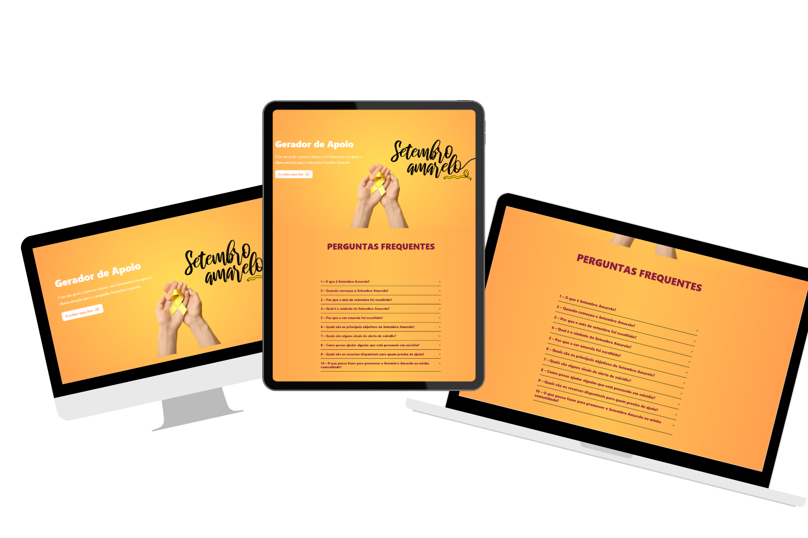

# Projeto Setembro Amarelo

Gerador de apoio para a campanha de prevenção a suicídio - setembro amarelo

## Índice
- <a>Funcionalidades do Projeto</a>
- <a>Layout</a>
- <a>Demonstração</a>
- <a>Como rodar este projeto?</a>
- <a>Tecnologias Utilizadas</a>

## Funcionalidades do Projeto
- [x] Upload da imagem
- [x] Recorte e redimensionamento da usa imagem com o frame de apoio
- [x] Download da imagem de apoio
- [x] Perguntas frequentes

## Layout


## Como rodar este projeto?
```bash

# Clone este repositório
$ git clone linkrepo

# Acesse a pasta do projeto no seu terminal
$ git clone linkrepo

# Instale as dependências
$ npm install

# Execute a aplicação
$ npm run start
```

## Tecnologias Utilizadas
1. [React](https://pt-br.legacy.reactjs.org/)
2. [Typescript](https://www.typescriptlang.org/pt/docs/)